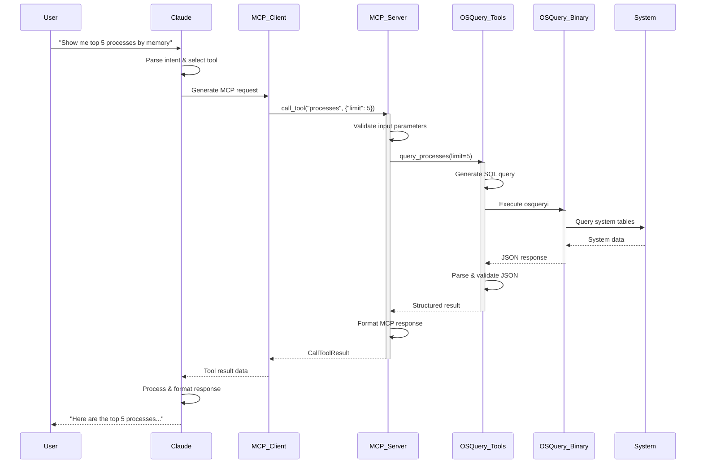
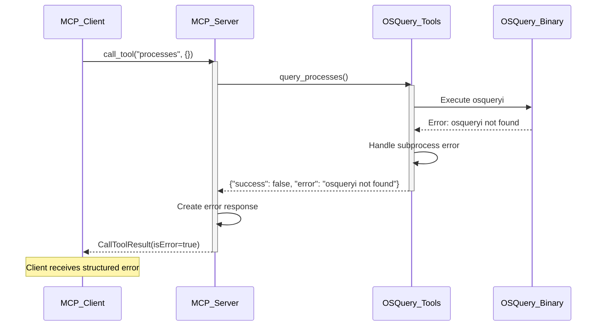
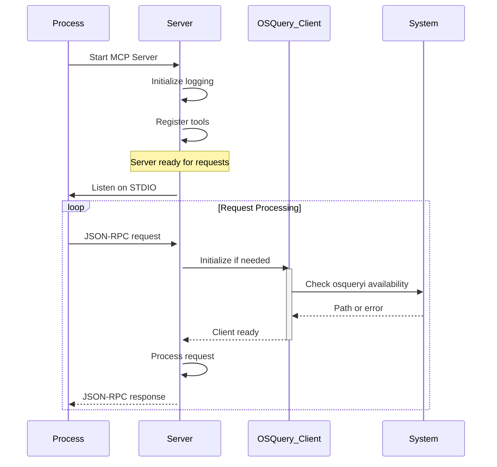
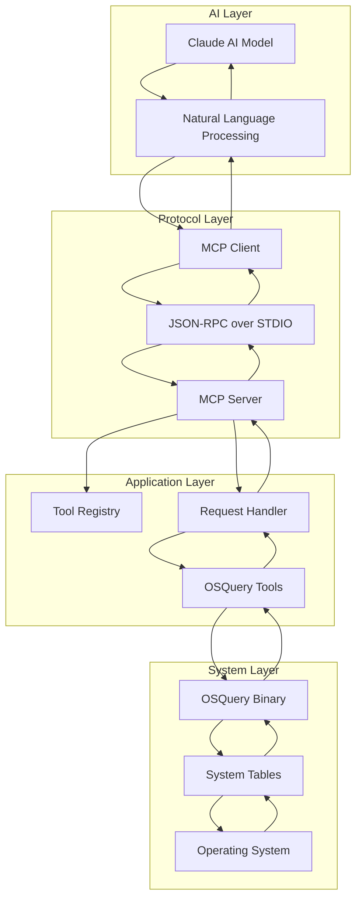
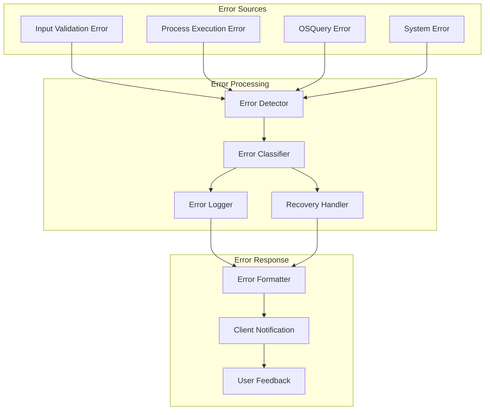
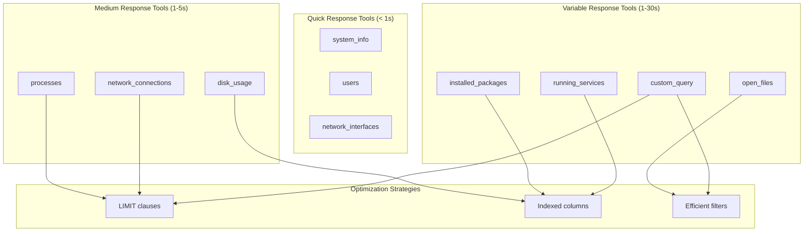
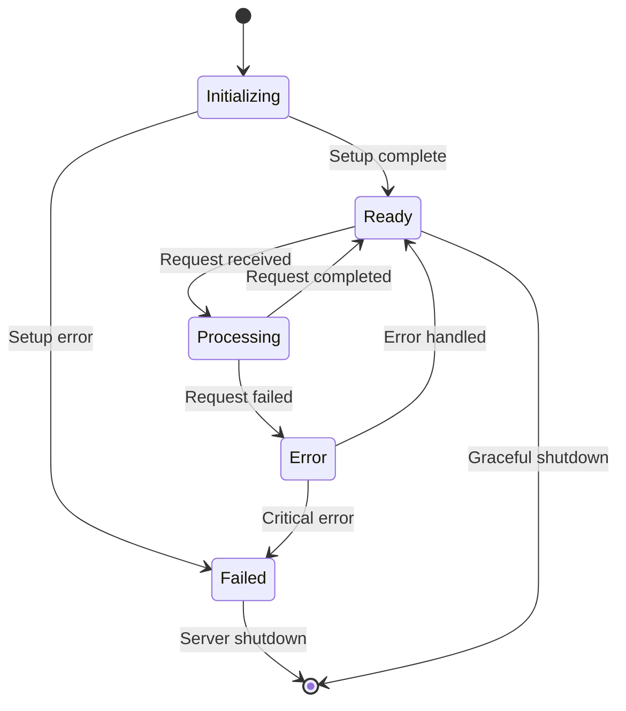
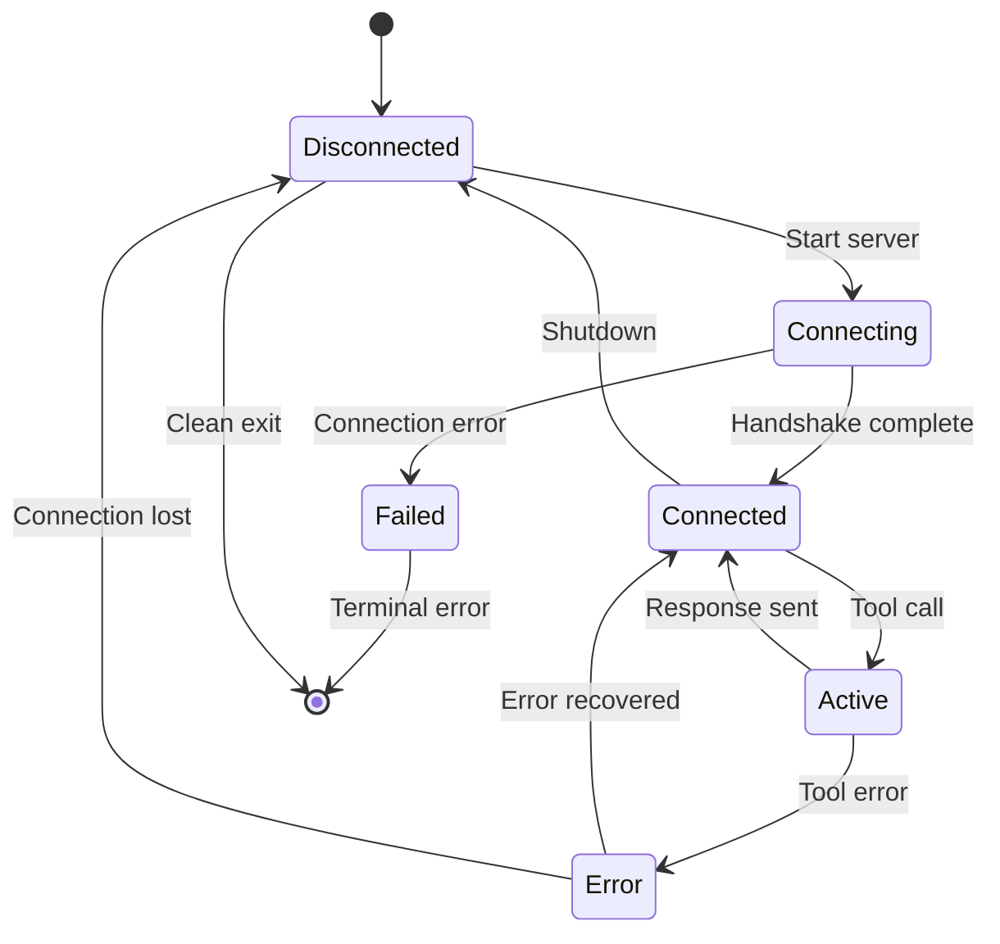
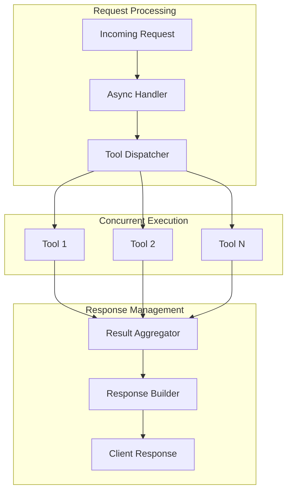

# MCP OSQuery Server - Interaction Diagrams

## Sequence Diagrams

### 1. Tool Execution Flow



### 2. Error Handling Flow



### 3. Server Initialization Flow



## Component Interaction Diagrams

### 1. System Overview



### 2. Data Flow Architecture

```mermaid
graph LR
    subgraph "Input Processing"
        A[User Query] --> B[AI Intent Recognition]
        B --> C[Tool Selection]
        C --> D[Parameter Extraction]
    end
    
    subgraph "MCP Layer"
        D --> E[MCP Request]
        E --> F[Tool Dispatcher]
        F --> G[Input Validation]
    end
    
    subgraph "Query Layer"
        G --> H[SQL Generation]
        H --> I[Process Execution]
        I --> J[Result Processing]
    end
    
    subgraph "System Layer"
        J --> K[OSQuery Binary]
        K --> L[System Tables]
        L --> M[Raw Data]
    end
    
    subgraph "Response Processing"
        M --> N[JSON Parsing]
        N --> O[Data Validation]
        O --> P[Response Formatting]
        P --> Q[User Response]
    end
```



### 3. Error Handling Architecture



## Tool Interaction Matrix

### Available Tools and Their Dependencies

| Tool | OSQuery Tables | System Requirements | Permissions |
|------|---------------|-------------------|-------------|
| **system_info** | `system_info` | None | User |
| **processes** | `processes` | None | User |
| **users** | `users` | None | User |
| **network_interfaces** | `interface_details` | None | User |
| **network_connections** | `process_open_sockets` | None | User |
| **open_files** | `process_open_files` | None | User/Root* |
| **disk_usage** | `mounts` | None | User |
| **installed_packages** | `programs`, `packages` | Platform specific | User |
| **running_services** | `launchd`, `systemd_units` | Platform specific | User/Root* |
| **custom_query** | Any valid table | Varies | User/Root* |

*\* Some queries may require elevated privileges*

### Tool Execution Patterns



## Communication Protocol Details

### MCP Request Structure

```json
{
  "jsonrpc": "2.0",
  "method": "tools/call",
  "params": {
    "name": "processes",
    "arguments": {
      "limit": 5
    }
  },
  "id": 1
}
```

### MCP Response Structure

```json
{
  "jsonrpc": "2.0",
  "result": {
    "content": [
      {
        "type": "text",
        "text": "[\n  {\n    \"pid\": \"250011\",\n    \"name\": \"node\",\n    \"uid\": \"1000\",\n    \"resident_size\": \"1198477312\"\n  }\n]"
      }
    ],
    "isError": false
  },
  "id": 1
}
```

### Error Response Structure

```json
{
  "jsonrpc": "2.0",
  "result": {
    "content": [
      {
        "type": "text",
        "text": "Error: osqueryi not found"
      }
    ],
    "isError": true
  },
  "id": 1
}
```

## State Management

### Server State Diagram



### Client Connection State



## Performance Characteristics

### Response Time Distribution

| Tool Category | Typical Response Time | 95th Percentile | Timeout |
|---------------|----------------------|-----------------|---------|
| **System Info** | 50-200ms | 500ms | 30s |
| **Process Queries** | 100-500ms | 2s | 30s |
| **Network Queries** | 200-1000ms | 3s | 30s |
| **File System** | 500-2000ms | 10s | 30s |
| **Custom Queries** | Variable | Variable | 30s |

### Concurrency Model



---

**Interaction Design Version**: 1.0  
**Last Updated**: November 9, 2025  
**Mermaid Version**: Compatible with latest renderers